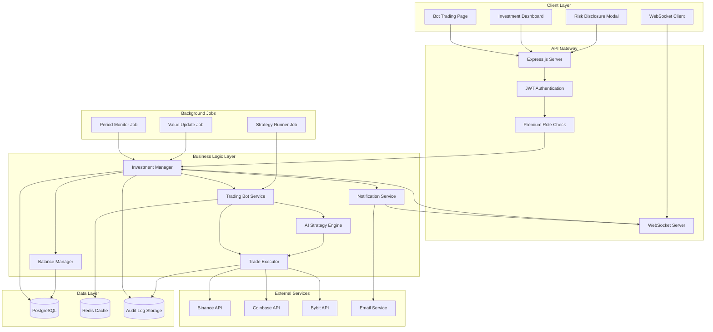

# Design Document: Otomatik Ticaret Botu

## Overview

Otomatik ticaret botu özelliği, mevcut kripto ticaret sinyalleri platformuna entegre edilen, kullanıcıların kripto para yatırarak AI tabanlı otomatik ticaret stratejileri ile pasif gelir elde etmelerini sağlayan bir sistemdir. Kullanıcılar 100-100,000 USDT arası yatırım yapabilir, 1-60 saat arası ticaret periyodu seçebilir ve BTC, ETH, BNB, SOL, ADA gibi popüler kripto paralarla işlem yapabilirler.

Sistem, mevcut Node.js/Express backend ve React frontend altyapısını kullanarak, PostgreSQL veritabanında yatırım kayıtlarını saklar ve Redis ile gerçek zamanlı veri önbellekleme yapar. Exchange entegrasyonları (Binance, Coinbase, Bybit) üzerinden gerçek alım-satım işlemleri gerçekleştirir ve karlı işlemlerden %1 komisyon alır.

Özellik, Premium abonelik gerektiren bir hizmet olarak sunulur ve kullanıcılara risk bildirimi gösterilerek yasal sorumluluk reddi sağlanır. Sistem, hata toleransı, güvenlik, ölçeklenebilirlik ve denetim izleri konularında kapsamlı önlemler içerir.

## Architecture

### System Architecture



### Technology Stack

**Frontend:**
- React 18+ for UI components
- Redux Toolkit for state management
- WebSocket client for real-time updates
- Recharts for investment value charts
- TailwindCSS for styling

**Backend:**
- Node.js 18+ runtime
- Express.js for REST API
- WebSocket (ws library) for real-time communication
- node-cron for scheduled jobs
- JWT for authentication

**Database:**
- PostgreSQL for persistent storage (investments, trades, audit logs)
- Redis for caching (market data, investment values)

**External Integrations:**
- Binance API SDK for trade execution
- Coinbase API SDK for trade execution
- Bybit API SDK for trade execution
- Email service (SendGrid/AWS SES) for notifications

### AI Strategy Research

AI tabanlı ticaret stratejisi için aşağıdaki yaklaşımlar değerlendirilmiştir:

**1. Technical Indicator Combination:**
- RSI (Relative Strength Index) - momentum göstergesi
- MACD (Moving Average Convergence Divergence) - trend takibi
- Bollinger Bands - volatilite ölçümü
- Volume analysis - işlem hacmi analizi

**2. Machine Learning Approach:**
- LSTM (Long Short-Term Memory) networks - zaman serisi tahmini
- Random Forest - çoklu gösterge kombinasyonu
- Gradient Boosting - yüksek doğruluk için

**3. Risk Management:**
- Position sizing - maksimum %20 tek işlem
- Stop-loss - %5 zarar durdurma
- Volatility pause - %10 üzeri volatilitede duraklama
- Confidence threshold - 0.7 üzeri sinyaller

**Seçilen Yaklaşım:** Teknik gösterge kombinasyonu + confidence scoring sistemi. Bu yaklaşım, gerçek zamanlı performans, açıklanabilirlik ve risk yönetimi dengesi sağlar. ML modelleri gelecekte ekleme için hazırlık yapılır.

### Real-time Communication Design

WebSocket kullanarak gerçek zamanlı yatırım değeri güncellemeleri:

**Connection Flow:**
1. Client connects to `/ws/investments` endpoint
2. Server authenticates JWT token
3. Server subscribes client to user's investment updates
4. Value updates pushed every 30 seconds
5. Trade executions pushed immediately

**Message Format:**
```typescript
{
  type: 'investment_update' | 'trade_executed' | 'investment_completed',
  data: {
    investmentId: string,
    currentValue: number,
    profitLoss: number,
    profitLossPercent: number,
    lastTrade?: Trade
  }
}
```

## Components and Interfaces

### Frontend Components

#### 1. BotTradingPage Component
```typescript
interface BotTradingPageProps {
  user: User;
}

interface BotTradingPageState {
  selectedCrypto: string;
  amount: number;
  period: number;
  riskAcknowledged: boolean;
  loading: boolean;
}

// Main page for creating new bot investments
// Shows cryptocurrency selector, amount input, period selector
// Displays risk disclosure modal before submission
```

#### 2. InvestmentDashboard Component
```typescript
interface InvestmentDashboardProps {
  user: User;
}

interface InvestmentDashboardState {
  activeInvestments: Investment[];
  completedInvestments: Investment[];
  totalPortfolioValue: number;
  lifetimeProfit: number;
  wsConnected: boolean;
}

interface Investment {
  id: string;
  cryptocurrency: string;
  principalAmount: number;
  currentValue: number;
  profitLoss: number;
  profitLossPercent: number;
  tradingPeriodHours: number;
  startTime: Date;
  endTime: Date;
  status: 'active' | 'completed' | 'cancelled';
  commission?: number;
  trades: Trade[];
}

// Displays active and completed investments
// Real-time updates via WebSocket
// Shows portfolio summary and lifetime stats
```

#### 3. RiskDisclosureModal Component
```typescript
interface RiskDisclosureModalProps {
  isOpen: boolean;
  onAcknowledge: () => void;
  onCancel: () => void;
}

// Modal displaying risk warnings
// Requires explicit user acknowledgment
// Blocks investment creation until acknowledged
```

#### 4. InvestmentCard Component
```typescript
interface InvestmentCardProps {
  investment: Investment;
  onCancel?: (id: string) => void;
}

// Displays single investment details
// Shows real-time value updates
// Provides cancellation option for active investments
// Shows value chart for investment period
```

#### 5. InvestmentValueChart Component
```typescript
interface InvestmentValueChartProps {
  investmentId: string;
  data: ValuePoint[];
}

interface ValuePoint {
  timestamp: Date;
  value: number;
}

// Real-time chart showing investment value over time
// Updates every 30 seconds via WebSocket
```

### Backend API Endpoints

#### Investment Endpoints

```typescript
POST /api/bot/investments
Headers: { Authorization: "Bearer <token>" }
Request: {
  cryptocurrency: string;      // BTC, ETH, BNB, SOL, ADA
  principalAmount: number;     // 100-100000 USDT
  tradingPeriodHours: number;  // 1,2,3,4,5,6,12,24,48,60
  riskAcknowledged: boolean;
}
Response: {
  investment: Investment;
}
// Creates new bot investment
// Validates balance, deducts principal
// Returns 403 if not premium user

GET /api/bot/investments
Headers: { Authorization: "Bearer <token>" }
Query: { status?: 'active' | 'completed' | 'cancelled' }
Response: {
  investments: Investment[];
  totalPortfolioValue: number;
  lifetimeProfit: number;
}
// Returns user's investments with optional status filter

GET /api/bot/investments/:id
Headers: { Authorization: "Bearer <token>" }
Response: {
  investment: Investment;
  trades: Trade[];
  valueHistory: ValuePoint[];
}
// Returns detailed investment information

POST /api/bot/investments/:id/cancel
Headers: { Authorization: "Bearer <token>" }
Response: {
  investment: Investment;
  refundAmount: number;
  cancellationFee: number;
}
// Cancels active investment
// Closes positions, applies 2% fee
// Credits remaining balance

GET /api/bot/investments/:id/value-history
Headers: { Authorization: "Bearer <token>" }
Response: {
  history: ValuePoint[];
}
// Returns investment value history for charting
```

#### Bot Configuration Endpoints

```typescript
GET /api/bot/supported-cryptocurrencies
Response: {
  cryptocurrencies: string[];  // ['BTC', 'ETH', 'BNB', 'SOL', 'ADA']
}
// Returns list of supported cryptocurrencies

GET /api/bot/trading-periods
Response: {
  periods: number[];  // [1,2,3,4,5,6,12,24,48,60]
}
// Returns available trading period options

GET /api/bot/limits
Response: {
  minAmount: number;     // 100
  maxAmount: number;     // 100000
  currency: string;      // 'USDT'
}
// Returns investment amount limits
```

#### Analytics Endpoints (Admin)

```typescript
GET /api/bot/analytics/daily
Headers: { Authorization: "Bearer <admin-token>" }
Query: { date?: string }
Response: {
  totalInvestments: number;
  totalProfit: number;
  totalCommission: number;
  winRate: number;
  averageProfitPercent: number;
}
// Daily performance analytics

GET /api/bot/analytics/by-cryptocurrency
Headers: { Authorization: "Bearer <admin-token>" }
Response: {
  analytics: {
    cryptocurrency: string;
    totalInvestments: number;
    winRate: number;
    averageProfit: number;
  }[];
}
// Performance breakdown by cryptocurrency
```

### Backend Services

#### 1. InvestmentManager Service

```typescript
class InvestmentManager {
  async createInvestment(
    userId: string,
    cryptocurrency: string,
    principalAmount: number,
    tradingPeriodHours: number,
    riskAcknowledgedAt: Date
  ): Promise<Investment>
  
  async getInvestments(
    userId: string,
    status?: InvestmentStatus
  ): Promise<Investment[]>
  
  async getInvestmentById(
    investmentId: string,
    userId: string
  ): Promise<Investment>
  
  async cancelInvestment(
    investmentId: string,
    userId: string
  ): Promise<{ investment: Investment; refundAmount: number }>
  
  async completeInvestment(investmentId: string): Promise<void>
  
  async updateInvestmentValue(
    investmentId: string,
    currentValue: number
  ): Promise<void>
  
  async getPortfolioSummary(userId: string): Promise<PortfolioSummary>
  
  // Validates investment parameters
  // Manages investment lifecycle
  // Coordinates with BalanceManager and TradingBot
  // Sends WebSocket updates
}
```

#### 2. TradingBot Service

```typescript
class TradingBot {
  async startTrading(investmentId: string): Promise<void>
  async stopTrading(investmentId: string): Promise<void>
  async executeStrategy(investmentId: string): Promise<void>
  async closeAllPositions(investmentId: string): Promise<number>
  async getCurrentValue(investmentId: string): Promise<number>
  
  private async analyzeMarket(cryptocurrency: string): Promise<MarketAnalysis>
  private async generateSignal(analysis: MarketAnalysis): Promise<TradingSignal>
  
  // Orchestrates trading operations
  // Runs strategy execution loop
  // Manages position tracking
  // Calculates current investment value
}
```

#### 3. AIStrategy Service

```typescript
class AIStrategy {
  async analyze(
    cryptocurrency: string,
    historicalData: PriceData[]
  ): Promise<StrategySignal>
  
  private calculateRSI(prices: number[], period: number = 14): number
  private calculateMACD(prices: number[]): MACDResult
  private calculateBollingerBands(prices: number[]): BollingerBands
  private calculateVolatility(prices: number[]): number
  
  private determineSignal(indicators: Indicators): TradingSignal
  private calculateConfidence(indicators: Indicators): number
  private calculatePositionSize(
    principalAmount: number,
    confidence: number
  ): number
  
  // Implements AI trading strategy
  // Combines technical indicators
  // Generates signals with confidence scores
  // Applies risk management rules
}

interface StrategySignal {
  action: 'buy' | 'sell' | 'hold';
  confidence: number;        // 0-1
  positionSize: number;      // USDT amount
  stopLoss: number;          // Price level
  reasoning: string;
}
```

#### 4. TradeExecutor Service

```typescript
class TradeExecutor {
  async executeBuy(
    cryptocurrency: string,
    amount: number,
    exchange?: string
  ): Promise<Trade>
  
  async executeSell(
    cryptocurrency: string,
    quantity: number,
    exchange?: string
  ): Promise<Trade>
  
  async getMarketPrice(cryptocurrency: string): Promise<number>
  
  private async executeWithRetry<T>(
    operation: () => Promise<T>,
    maxRetries: number = 3
  ): Promise<T>
  
  private async selectExchange(): Promise<ExchangeClient>
  private async handleExchangeFailover(error: Error): Promise<ExchangeClient>
  
  // Executes trades on exchanges
  // Implements retry logic with exponential backoff
  // Handles exchange failover
  // Respects rate limits
  // Logs all operations for audit
}

interface Trade {
  id: string;
  investmentId: string;
  tradeType: 'buy' | 'sell';
  cryptocurrency: string;
  quantity: number;
  price: number;
  totalValue: number;
  exchange: string;
  executedAt: Date;
  strategyConfidence: number;
}
```

#### 5. BalanceManager Service

```typescript
class BalanceManager {
  async getUserBalance(userId: string): Promise<number>
  
  async getAvailableBalance(userId: string): Promise<number>
  
  async deductForInvestment(
    userId: string,
    amount: number,
    investmentId: string
  ): Promise<void>
  
  async creditFromInvestment(
    userId: string,
    amount: number,
    investmentId: string
  ): Promise<void>
  
  async validateSufficientBalance(
    userId: string,
    amount: number
  ): Promise<boolean>
  
  // Manages user balance operations
  // Ensures atomic transactions
  // Maintains audit trail
  // Calculates available balance (total - locked in investments)
}
```

#### 6. NotificationService

```typescript
class NotificationService {
  async sendInvestmentCreated(
    userId: string,
    investment: Investment
  ): Promise<void>
  
  async sendInvestmentCompleted(
    userId: string,
    investment: Investment,
    finalResults: InvestmentResults
  ): Promise<void>
  
  async sendProfitMilestone(
    userId: string,
    investment: Investment,
    profitPercent: number
  ): Promise<void>
  
  async sendLossWarning(
    userId: string,
    investment: Investment,
    lossPercent: number
  ): Promise<void>
  
  async sendInvestmentCancelled(
    userId: string,
    investment: Investment
  ): Promise<void>
  
  async sendErrorNotification(
    userId: string,
    investment: Investment,
    error: Error
  ): Promise<void>
  
  // Sends email and in-app notifications
  // Respects user notification preferences
  // Queues notifications for delivery
}
```

### Background Jobs

#### 1. Period Monitor Job

```typescript
// Runs every 60 seconds
// Checks for investments reaching end time
// Triggers investment completion

async function periodMonitorJob() {
  const expiredInvestments = await findExpiredInvestments();
  
  for (const investment of expiredInvestments) {
    await investmentManager.completeInvestment(investment.id);
  }
}
```

#### 2. Value Update Job

```typescript
// Runs every 30 seconds
// Updates current value for all active investments
// Sends WebSocket updates to connected clients

async function valueUpdateJob() {
  const activeInvestments = await findActiveInvestments();
  
  for (const investment of activeInvestments) {
    const currentValue = await tradingBot.getCurrentValue(investment.id);
    await investmentManager.updateInvestmentValue(investment.id, currentValue);
    
    // Send WebSocket update
    wsServer.sendToUser(investment.userId, {
      type: 'investment_update',
      data: { investmentId: investment.id, currentValue }
    });
  }
}
```

#### 3. Strategy Runner Job

```typescript
// Runs every 10 seconds
// Executes AI strategy for active investments
// Generates and executes trading signals

async function strategyRunnerJob() {
  const activeInvestments = await findActiveInvestments();
  
  for (const investment of activeInvestments) {
    await tradingBot.executeStrategy(investment.id);
  }
}
```

## Data Models

### BotInvestment Model

```typescript
interface BotInvestment {
  id: string;
  userId: string;
  cryptocurrency: string;
  principalAmount: number;
  tradingPeriodHours: number;
  startTime: Date;
  endTime: Date;
  status: 'active' | 'completed' | 'cancelled';
  currentValue: number;
  finalValue: number | null;
  profit: number | null;
  commission: number | null;
  riskAcknowledgedAt: Date;
  cancellationReason: string | null;
  cancelledAt: Date | null;
  createdAt: Date;
  updatedAt: Date;
}

// Database table: bot_investments
// Indexes:
//   - user_id (for user queries)
//   - status (for active investment queries)
//   - end_time (for period monitoring)
//   - cryptocurrency (for analytics)
```

### BotTrade Model

```typescript
interface BotTrade {
  id: string;
  investmentId: string;
  tradeType: 'buy' | 'sell';
  cryptocurrency: string;
  quantity: number;
  price: number;
  totalValue: number;
  exchange: string;
  executedAt: Date;
  strategyConfidence: number;
  createdAt: Date;
}

// Database table: bot_trades
// Indexes:
//   - investment_id (for trade history)
//   - executed_at (for time-based queries)
//   - exchange (for exchange analytics)
```

### BotPosition Model

```typescript
interface BotPosition {
  id: string;
  investmentId: string;
  cryptocurrency: string;
  quantity: number;
  entryPrice: number;
  currentPrice: number;
  stopLoss: number;
  status: 'open' | 'closed';
  openedAt: Date;
  closedAt: Date | null;
  profitLoss: number | null;
}

// Database table: bot_positions
// Tracks open positions for each investment
// Indexes:
//   - investment_id
//   - status
```

### InvestmentValueHistory Model

```typescript
interface InvestmentValueHistory {
  id: string;
  investmentId: string;
  value: number;
  timestamp: Date;
}

// Database table: investment_value_history
// Stores value snapshots for charting
// Indexes:
//   - investment_id, timestamp (composite)
```

### AuditLog Model

```typescript
interface AuditLog {
  id: string;
  entityType: 'investment' | 'trade' | 'balance';
  entityId: string;
  action: string;
  oldState: any;
  newState: any;
  userId: string | null;
  ipAddress: string | null;
  timestamp: Date;
}

// Database table: audit_logs
// Immutable audit trail
// Indexes:
//   - entity_type, entity_id (composite)
//   - timestamp
//   - user_id
```


## Correctness Properties

*A property is a characteristic or behavior that should hold true across all valid executions of a system—essentially, a formal statement about what the system should do. Properties serve as the bridge between human-readable specifications and machine-verifiable correctness guarantees.*

### Property Reflection

After analyzing all acceptance criteria, I identified the following redundancies:
- Properties 1.6 and 11.1 both test balance deduction on investment creation (consolidated)
- Properties 6.7 and 11.2 both test balance credit on investment completion (consolidated)
- Properties 6.5 and 7.1 both test commission calculation for positive profit (consolidated)
- Properties 11.3 and 15.4 both test transaction rollback on failure (consolidated)
- Properties 1.2 and 11.5 both test balance validation before investment creation (consolidated)
- Properties 3.7 and 19.5 both test risk acknowledgment timestamp recording (consolidated)
- Properties 4.5, 19.2, and 12.7 all test audit logging completeness (consolidated into comprehensive audit property)

The following properties provide unique validation value and will be included:

### Property 1: Investment amount validation
*For any* investment creation request, investments with amounts between 100 and 100,000 USDT (inclusive) should be accepted, and amounts outside this range should be rejected.
**Validates: Requirements 1.1**

### Property 2: Sufficient balance validation
*For any* user and investment amount, investment creation should only succeed when the user's available balance is greater than or equal to the principal amount.
**Validates: Requirements 1.2, 11.5**

### Property 3: Trading period validation
*For any* investment creation request, only trading periods from the set {1, 2, 3, 4, 5, 6, 12, 24, 48, 60} hours should be accepted, and all other values should be rejected.
**Validates: Requirements 1.3**

### Property 4: Cryptocurrency validation
*For any* cryptocurrency selection, only cryptocurrencies in the supported list (BTC, ETH, BNB, SOL, ADA) should be accepted for investment creation.
**Validates: Requirements 1.4**

### Property 5: Initial investment status
*For any* successfully created investment, the investment status should be "active".
**Validates: Requirements 1.5**

### Property 6: Balance deduction on investment creation
*For any* successful investment creation, the user's balance after creation should equal the balance before creation minus the principal amount.
**Validates: Requirements 1.6, 11.1**

### Property 7: Timestamp precision
*For any* created investment, the start timestamp should have millisecond precision (timestamp modulo 1000 should be non-zero for at least some investments).
**Validates: Requirements 1.7**

### Property 8: Risk acknowledgment recording
*For any* created investment, the investment record should include a risk acknowledgment timestamp.
**Validates: Requirements 3.7, 19.5**

### Property 9: Trade exchange validation
*For any* executed trade, the exchange field should be one of the supported exchanges (Binance, Coinbase, Bybit).
**Validates: Requirements 4.2**

### Property 10: Trade record completeness
*For any* executed trade, the trade record should include timestamp, price, quantity, and exchange fields with valid non-null values.
**Validates: Requirements 4.5**

### Property 11: Retry on exchange failure
*For any* exchange API operation that fails, the system should retry the operation up to 3 times before giving up.
**Validates: Requirements 4.6**

### Property 12: Error logging on retry exhaustion
*For any* exchange API operation where all retry attempts fail, an error should be logged to the audit system.
**Validates: Requirements 4.7**

### Property 13: Signal confidence range
*For any* trading signal generated by the AI strategy, the confidence score should be between 0 and 1 (inclusive).
**Validates: Requirements 5.3**

### Property 14: Confidence threshold for execution
*For any* trade executed by the system, the associated strategy confidence score should be greater than or equal to 0.7.
**Validates: Requirements 5.4**

### Property 15: Position size limit
*For any* trade executed for an investment, the trade size should not exceed 20% of the investment's principal amount.
**Validates: Requirements 5.5**

### Property 16: Stop-loss calculation
*For any* open position, the stop-loss price should be set at 95% of the entry price (5% below entry).
**Validates: Requirements 5.6**

### Property 17: Investment completion trigger
*For any* investment that has reached or passed its end time, the investment should be marked for completion and processed.
**Validates: Requirements 6.2**

### Property 18: Position closure on completion
*For any* completed investment, all positions associated with that investment should have status "closed".
**Validates: Requirements 6.3**

### Property 19: Profit calculation
*For any* completed investment, the profit should equal (final_value - principal_amount).
**Validates: Requirements 6.4**

### Property 20: Commission calculation for profit
*For any* completed investment with positive profit, the commission should equal (profit * 0.01).
**Validates: Requirements 6.5, 7.1, 20.7**

### Property 21: Zero commission for non-profit
*For any* completed investment with zero or negative profit, the commission should be zero.
**Validates: Requirements 7.2**

### Property 22: Payout calculation
*For any* completed investment, the user payout should equal (principal_amount + profit - commission).
**Validates: Requirements 6.6**

### Property 23: Balance credit on completion
*For any* completed investment, the user's balance after completion should equal the balance before completion plus the payout amount.
**Validates: Requirements 6.7, 11.2**

### Property 24: Completed investment status
*For any* investment that has finished its trading period, the investment status should be "completed".
**Validates: Requirements 6.8**

### Property 25: Commission field presence
*For any* completed investment, the investment record should have a non-null commission field.
**Validates: Requirements 7.3**

### Property 26: Platform revenue accumulation
*For any* set of completed investments, the total platform revenue should equal the sum of all commission amounts.
**Validates: Requirements 7.4**

### Property 27: Active investments display completeness
*For any* user, the investment dashboard should display all investments with status "active" belonging to that user.
**Validates: Requirements 8.1**

### Property 28: Completed investments display completeness
*For any* user, the investment dashboard should display all investments with status "completed" belonging to that user.
**Validates: Requirements 8.2**

### Property 29: Active investment display fields
*For any* active investment displayed on the dashboard, the display should include principal_amount, cryptocurrency, trading_period_hours, and current_value fields.
**Validates: Requirements 8.3**

### Property 30: Completed investment display fields
*For any* completed investment displayed on the dashboard, the display should include principal_amount, final_value, profit, commission, and completion timestamp fields.
**Validates: Requirements 8.4**

### Property 31: Portfolio value calculation
*For any* user with active investments, the total portfolio value should equal the sum of current_value across all active investments.
**Validates: Requirements 8.6**

### Property 32: Lifetime profit calculation
*For any* user with completed investments, the lifetime profit should equal the sum of profit values across all completed investments.
**Validates: Requirements 8.7**

### Property 33: Position closure on cancellation
*For any* cancelled investment, all positions associated with that investment should have status "closed".
**Validates: Requirements 9.3**

### Property 34: Cancellation fee calculation
*For any* cancelled investment, the cancellation fee should equal (principal_amount * 0.02).
**Validates: Requirements 9.5**

### Property 35: Refund calculation on cancellation
*For any* cancelled investment, the user's balance after cancellation should equal the balance before cancellation plus (current_value - cancellation_fee).
**Validates: Requirements 9.6**

### Property 36: Cancelled investment status
*For any* investment that has been cancelled, the investment status should be "cancelled" and should have a non-null cancellation timestamp.
**Validates: Requirements 9.7**

### Property 37: Transaction rollback on failure
*For any* investment operation that encounters a database error, no changes should be persisted to the database (balance, investment records, etc. should remain unchanged).
**Validates: Requirements 11.3, 15.4**

### Property 38: Balance change audit logging
*For any* balance change operation (deduction or credit), an audit log entry should be created with the investment reference, old balance, new balance, and timestamp.
**Validates: Requirements 11.4**

### Property 39: Available balance calculation
*For any* user, the available balance should equal (total_balance - sum of principal_amounts for all active investments).
**Validates: Requirements 11.6**

### Property 40: Value change notification threshold
*For any* active investment where the current value changes by more than 1% from the previous value, a push notification should be sent to the user.
**Validates: Requirements 13.3**

### Property 41: Profit/loss percentage calculation
*For any* active investment, the displayed profit/loss percentage should equal ((current_value - principal_amount) / principal_amount * 100).
**Validates: Requirements 13.4**

### Property 42: Authentication requirement
*For any* investment operation endpoint, requests without valid authentication tokens should be rejected with 401 status.
**Validates: Requirements 14.1**

### Property 43: Authorization enforcement
*For any* investment operation, users should only be able to access and modify their own investment records, not other users' investments.
**Validates: Requirements 14.2**

### Property 44: Premium subscription requirement
*For any* bot trading feature access attempt, users without active premium subscription should be rejected with 403 status.
**Validates: Requirements 14.3**

### Property 45: Security audit logging
*For any* investment operation, an audit log entry should be created with user_id, IP address, operation type, and timestamp.
**Validates: Requirements 14.5**

### Property 46: Critical error handling
*For any* critical error encountered during trading, the affected investment should be paused and an administrator notification should be sent.
**Validates: Requirements 15.1**

### Property 47: Completion retry on failure
*For any* investment completion operation that fails, the system should retry the completion operation multiple times before giving up.
**Validates: Requirements 15.2**

### Property 48: Failure recording and continuation
*For any* trade execution that fails after all retries, the failure should be recorded and other investment operations should continue unaffected.
**Validates: Requirements 15.3**

### Property 49: Circuit breaker activation
*For any* exchange API, when 5 consecutive failures occur, the circuit breaker should open and prevent further calls to that exchange.
**Validates: Requirements 15.5**

### Property 50: Error notification to users
*For any* investment that encounters an error requiring manual intervention, an email notification should be sent to the investment owner.
**Validates: Requirements 15.7**

### Property 51: Win rate calculation
*For any* set of completed investments, the win rate should equal (count of investments with positive profit / total count of completed investments).
**Validates: Requirements 17.2**

### Property 52: Average profit calculation
*For any* set of completed investments, the average profit percentage should equal (sum of all profit percentages / count of completed investments).
**Validates: Requirements 17.3**

### Property 53: Investment creation notification
*For any* successfully created investment, a confirmation notification should be sent to the user.
**Validates: Requirements 18.1**

### Property 54: Investment completion notification
*For any* completed investment, a completion notification with final results should be sent to the user.
**Validates: Requirements 18.2**

### Property 55: Profit milestone notification
*For any* active investment where profit exceeds 10%, a milestone notification should be sent to the user.
**Validates: Requirements 18.3**

### Property 56: Loss warning notification
*For any* active investment where loss exceeds 5%, a warning notification should be sent to the user.
**Validates: Requirements 18.4**

### Property 57: Cancellation notification
*For any* cancelled investment, a cancellation confirmation notification should be sent to the user.
**Validates: Requirements 18.5**

### Property 58: Notification preference respect
*For any* notification sent to a user, the notification should only be delivered through channels enabled in the user's notification preferences.
**Validates: Requirements 18.7**

### Property 59: Investment state change audit logging
*For any* investment status change, an audit log entry should be created with timestamp, old status, new status, and triggering user or process.
**Validates: Requirements 19.1**

### Property 60: Trade execution audit logging
*For any* trade execution, an audit log entry should be created with full order details, exchange response, and timestamp.
**Validates: Requirements 19.2**

## Error Handling

### Investment Creation Errors

**Insufficient Balance:**
- Return 400 Bad Request with message: "Yetersiz bakiye. Mevcut bakiye: {balance} USDT, Gerekli: {amount} USDT"
- Do not create investment record

**Invalid Amount:**
- Return 400 Bad Request with message: "Yatırım tutarı 100-100,000 USDT arasında olmalıdır"
- Specify current limits in response

**Invalid Trading Period:**
- Return 400 Bad Request with message: "Geçersiz ticaret periyodu. Desteklenen periyotlar: 1, 2, 3, 4, 5, 6, 12, 24, 48, 60 saat"
- Include list of valid periods

**Unsupported Cryptocurrency:**
- Return 400 Bad Request with message: "Desteklenmeyen kripto para: {symbol}"
- Include list of supported cryptocurrencies: BTC, ETH, BNB, SOL, ADA

**Risk Not Acknowledged:**
- Return 400 Bad Request with message: "Risk bildirimi onaylanmalıdır"
- Require explicit acknowledgment before proceeding

**Premium Subscription Required:**
- Return 403 Forbidden with message: "Bot ticaret özelliği Premium üyelik gerektirir"
- Include upgrade URL in response

### Trading Execution Errors

**Exchange API Failure:**
- Log error with full details
- Retry with exponential backoff (1s, 2s, 4s)
- Failover to alternative exchange after 3 failed attempts
- If all exchanges fail, pause investment and notify administrators

**Insufficient Liquidity:**
- Log warning
- Reduce position size to available liquidity
- Continue with reduced trade size

**Rate Limit Exceeded:**
- Implement exponential backoff
- Queue trade for next available slot
- Do not fail the investment

**Invalid Order Parameters:**
- Log error with order details
- Skip the trade
- Continue monitoring for next signal

### Investment Completion Errors

**Position Closure Failure:**
- Retry closing positions every 5 minutes
- Continue retries for up to 24 hours
- After 24 hours, notify administrators for manual intervention
- Do not credit user balance until all positions closed

**Balance Credit Failure:**
- Rollback investment completion
- Retry entire completion process
- Log error for audit
- Notify user of delay

**Database Transaction Failure:**
- Rollback all changes
- Return 500 Internal Server Error
- Message: "Yatırım tamamlama işlemi başarısız oldu. Lütfen tekrar deneyin"
- Retry automatically on next period check

### Investment Cancellation Errors

**Investment Not Found:**
- Return 404 Not Found with message: "Yatırım bulunamadı"

**Investment Not Active:**
- Return 400 Bad Request with message: "Sadece aktif yatırımlar iptal edilebilir"
- Include current investment status

**Position Closure Failure:**
- Return 500 Internal Server Error
- Message: "Pozisyonlar kapatılamadı. Lütfen daha sonra tekrar deneyin"
- Do not change investment status
- Retry on next user request

**Unauthorized Access:**
- Return 403 Forbidden with message: "Bu yatırıma erişim yetkiniz yok"
- Log security event with user_id and IP address

### WebSocket Errors

**Connection Failure:**
- Client should implement automatic reconnection with exponential backoff
- Server should clean up stale connections after 5 minutes of inactivity

**Authentication Failure:**
- Close WebSocket connection with code 4001
- Message: "Kimlik doğrulama başarısız"
- Client should redirect to login

**Message Parsing Error:**
- Log error on server
- Send error message to client
- Continue connection

### Circuit Breaker Errors

**Circuit Open:**
- Return 503 Service Unavailable
- Message: "Exchange geçici olarak kullanılamıyor. Lütfen birkaç dakika sonra tekrar deneyin"
- Use cached data if available
- Automatically attempt recovery after 60 seconds

**Half-Open Test Failure:**
- Return to open state
- Wait another 60 seconds before retry
- Log circuit breaker state changes

### General Error Response Format

All error responses follow this structure:

```typescript
interface ErrorResponse {
  error: {
    code: string;           // Machine-readable error code
    message: string;        // Human-readable Turkish message
    details?: any;          // Optional additional context
    timestamp: string;      // ISO 8601 timestamp
    requestId: string;      // For support tracking
  }
}
```

### Error Codes

- `INSUFFICIENT_BALANCE`: User balance too low
- `INVALID_AMOUNT`: Investment amount out of range
- `INVALID_PERIOD`: Trading period not supported
- `UNSUPPORTED_CRYPTO`: Cryptocurrency not supported
- `RISK_NOT_ACKNOWLEDGED`: Risk disclosure not accepted
- `PREMIUM_REQUIRED`: Premium subscription needed
- `EXCHANGE_ERROR`: Exchange API failure
- `POSITION_CLOSURE_FAILED`: Cannot close positions
- `BALANCE_CREDIT_FAILED`: Cannot credit user balance
- `INVESTMENT_NOT_FOUND`: Investment ID not found
- `INVESTMENT_NOT_ACTIVE`: Investment not in active state
- `UNAUTHORIZED`: Authentication required
- `FORBIDDEN`: Insufficient permissions
- `CIRCUIT_OPEN`: Circuit breaker activated
- `DATABASE_ERROR`: Database operation failed

## Testing Strategy

### Overview

The testing strategy employs a dual approach combining unit tests for specific examples and edge cases with property-based tests for universal correctness properties. This ensures both concrete bug detection and general correctness verification across a wide range of inputs.

### Property-Based Testing

**Framework:** fast-check (for JavaScript/TypeScript)

**Configuration:**
- Minimum 100 iterations per property test
- Each test tagged with feature name and property number
- Tag format: `Feature: auto-trading-bot, Property {N}: {property description}`

**Property Test Coverage:**

Each of the 60 correctness properties defined in this document must be implemented as a property-based test. Property tests will:
- Generate random valid inputs (users, investments, amounts, cryptocurrencies, etc.)
- Execute the system behavior
- Verify the property holds for all generated inputs
- Report counterexamples when properties fail

**Example Property Test Structure:**

```typescript
// Feature: auto-trading-bot, Property 1: Investment amount validation
test('investment amount validation', async () => {
  await fc.assert(
    fc.asyncProperty(
      fc.record({
        userId: fc.uuid(),
        cryptocurrency: fc.constantFrom('BTC', 'ETH', 'BNB', 'SOL', 'ADA'),
        amount: fc.double({ min: 0, max: 200000 }),
        tradingPeriodHours: fc.constantFrom(1, 2, 3, 4, 5, 6, 12, 24, 48, 60)
      }),
      async (investmentData) => {
        const result = await investmentManager.createInvestment(investmentData);
        
        if (investmentData.amount >= 100 && investmentData.amount <= 100000) {
          expect(result.success).toBe(true);
        } else {
          expect(result.success).toBe(false);
          expect(result.error.code).toBe('INVALID_AMOUNT');
        }
      }
    ),
    { numRuns: 100 }
  );
});

// Feature: auto-trading-bot, Property 20: Commission calculation for profit
test('commission calculation for positive profit', async () => {
  await fc.assert(
    fc.asyncProperty(
      fc.record({
        principalAmount: fc.double({ min: 100, max: 100000 }),
        finalValue: fc.double({ min: 100, max: 200000 })
      }).filter(data => data.finalValue > data.principalAmount), // Only positive profit
      async (data) => {
        const profit = data.finalValue - data.principalAmount;
        const expectedCommission = profit * 0.01;
        
        const investment = await createAndCompleteInvestment(data);
        
        expect(investment.commission).toBeCloseTo(expectedCommission, 2);
      }
    ),
    { numRuns: 100 }
  );
});
```

### Unit Testing

**Framework:** Jest (for JavaScript/TypeScript)

**Unit Test Focus:**
- Specific examples demonstrating correct behavior
- Edge cases (minimum/maximum amounts, boundary values, empty states)
- Error conditions and exception handling
- Integration points between components

**Unit Test Coverage Areas:**

1. **Investment Creation:**
   - Valid investment with BTC, 1000 USDT, 24 hours
   - Minimum amount (100 USDT)
   - Maximum amount (100,000 USDT)
   - Invalid amount (50 USDT, 150,000 USDT)
   - Insufficient balance
   - Invalid trading period (7 hours)
   - Unsupported cryptocurrency (DOGE)
   - Risk not acknowledged

2. **AI Strategy:**
   - Signal generation with high confidence (>0.7)
   - Signal generation with low confidence (<0.7)
   - Position size calculation (should be ≤20% of principal)
   - Stop-loss calculation (should be 5% below entry)
   - Volatility pause trigger (>10% in 5 minutes)

3. **Trade Execution:**
   - Successful buy order on Binance
   - Successful sell order on Coinbase
   - Exchange failover on Binance failure
   - Retry logic with exponential backoff
   - Circuit breaker activation after 5 failures
   - Rate limit handling

4. **Investment Completion:**
   - Profitable investment (profit > 0)
   - Break-even investment (profit = 0)
   - Loss investment (profit < 0)
   - Commission calculation (1% of profit)
   - Payout calculation
   - Balance credit
   - Status update to "completed"

5. **Investment Cancellation:**
   - Active investment cancellation
   - Position closure
   - Cancellation fee (2% of principal)
   - Refund calculation
   - Status update to "cancelled"

6. **Balance Management:**
   - Balance deduction on investment creation
   - Balance credit on investment completion
   - Available balance calculation
   - Transaction rollback on failure
   - Audit log creation

7. **Notifications:**
   - Investment creation confirmation
   - Investment completion notification
   - Profit milestone (>10%)
   - Loss warning (>5%)
   - Cancellation confirmation
   - Error notification

8. **WebSocket Communication:**
   - Connection establishment
   - Authentication
   - Investment value updates
   - Trade execution notifications
   - Connection cleanup

### Integration Testing

**Focus:** End-to-end investment lifecycle flows

**Key Scenarios:**

1. **Complete Investment Lifecycle:**
   - User creates investment → Bot executes trades → Period ends → Investment completes → User receives payout

2. **Profitable Investment:**
   - Create investment → Execute profitable trades → Complete with profit → Verify commission deduction → Verify balance credit

3. **Loss Investment:**
   - Create investment → Execute losing trades → Complete with loss → Verify zero commission → Verify balance credit

4. **Early Cancellation:**
   - Create investment → Execute some trades → User cancels → Positions closed → Cancellation fee applied → Refund credited

5. **Exchange Failover:**
   - Create investment → Binance fails → Failover to Coinbase → Trade executes successfully

6. **Real-time Updates:**
   - User connects via WebSocket → Investment value updates every 30 seconds → Trade notifications pushed immediately

7. **Error Recovery:**
   - Investment completion fails → Retry every 5 minutes → Eventually succeeds → User balance credited

### Test Data Management

**Fixtures:**
- Sample users (normal and premium)
- Sample cryptocurrencies (BTC, ETH, BNB, SOL, ADA)
- Sample investments (active, completed, cancelled)
- Sample trades (buy, sell, various exchanges)
- Sample market data (prices, volumes, volatility)

**Mocking:**
- Exchange APIs mocked for consistent test results
- AI strategy mocked for predictable signals
- Time mocked for period expiration tests
- WebSocket connections mocked for real-time tests
- Email service mocked for notification tests

**Test Database:**
- Separate test database with migrations
- Seed data for common test scenarios
- Cleanup after each test suite
- Transaction rollback for isolated tests

### Continuous Integration

**Test Execution:**
- All tests run on every commit
- Property tests run with 100 iterations in CI
- Integration tests run against test database
- Code coverage target: 90% minimum (as per Requirement 20.1)

**Performance Benchmarks:**
- Investment creation < 2 seconds
- Trade execution < 5 seconds
- Dashboard load < 1 second
- WebSocket message latency < 100ms

### Test Organization

```
tests/
├── unit/
│   ├── services/
│   │   ├── investmentManager.test.ts
│   │   ├── tradingBot.test.ts
│   │   ├── aiStrategy.test.ts
│   │   ├── tradeExecutor.test.ts
│   │   ├── balanceManager.test.ts
│   │   └── notificationService.test.ts
│   ├── jobs/
│   │   ├── periodMonitor.test.ts
│   │   ├── valueUpdater.test.ts
│   │   └── strategyRunner.test.ts
│   └── models/
│       ├── botInvestment.test.ts
│       ├── botTrade.test.ts
│       └── botPosition.test.ts
├── property/
│   ├── investmentCreation.property.test.ts
│   ├── investmentCompletion.property.test.ts
│   ├── investmentCancellation.property.test.ts
│   ├── balanceOperations.property.test.ts
│   ├── commissionCalculation.property.test.ts
│   ├── tradeExecution.property.test.ts
│   ├── aiStrategy.property.test.ts
│   ├── notifications.property.test.ts
│   ├── authorization.property.test.ts
│   └── auditLogging.property.test.ts
├── integration/
│   ├── investmentLifecycle.test.ts
│   ├── profitableInvestment.test.ts
│   ├── lossInvestment.test.ts
│   ├── earlyCancellation.test.ts
│   ├── exchangeFailover.test.ts
│   ├── realtimeUpdates.test.ts
│   └── errorRecovery.test.ts
└── fixtures/
    ├── users.ts
    ├── cryptocurrencies.ts
    ├── investments.ts
    ├── trades.ts
    └── marketData.ts
```

This comprehensive testing strategy ensures the auto-trading-bot feature is reliable, secure, handles errors gracefully, and functions correctly across all user scenarios and edge cases. The combination of property-based testing for universal correctness and unit testing for specific scenarios provides robust quality assurance for user funds and system integrity.
