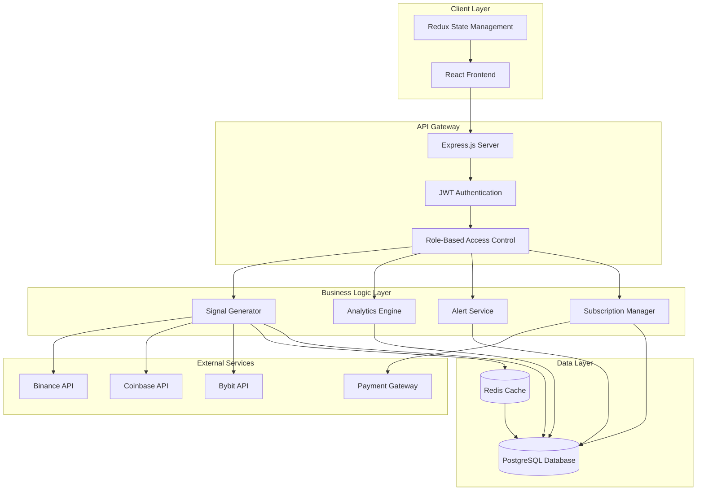

# Design Document: Cryptocurrency Trading Signals SaaS

## Overview

The cryptocurrency trading signals SaaS is a full-stack web application built with Node.js and React that provides users with AI-driven trading recommendations for cryptocurrencies. The system integrates with major exchange APIs (Binance, Coinbase, Bybit) to fetch real-time market data and generates trading signals using algorithmic analysis. The platform implements a two-tier membership model (normal and premium) with role-based access control to differentiate feature availability.

The architecture follows a client-server model with a React frontend for the user interface and a Node.js/Express backend for business logic, API integrations, and data processing. The system uses JWT-based authentication and implements RBAC for authorization.

## Architecture

### System Architecture



### Technology Stack

**Frontend:**
- React 18+ for UI components
- Redux Toolkit for state management
- Axios for HTTP requests
- Chart.js or Recharts for data visualization
- TailwindCSS for styling

**Backend:**
- Node.js 18+ runtime
- Express.js for REST API
- JWT for authentication
- bcrypt for password hashing
- node-cron for scheduled tasks

**Database:**
- PostgreSQL for persistent data storage
- Redis for caching and real-time data

**External Integrations:**
- Binance API SDK
- Coinbase API SDK
- Bybit API SDK
- Stripe for payment processing

## Components and Interfaces

### Frontend Components

#### 1. HomePage Component
```typescript
interface HomePageProps {
  user: User | null;
}

interface HomePageState {
  selectedCrypto: Cryptocurrency | null;
  signal: TradingSignal | null;
  loading: boolean;
}

// Renders the main single-page interface with:
// - Cryptocurrency selector/search
// - Trading signal display
// - Historical performance section
// - Premium signal results at bottom
```

#### 2. CryptoSelector Component
```typescript
interface CryptoSelectorProps {
  cryptocurrencies: Cryptocurrency[];
  onSelect: (crypto: Cryptocurrency) => void;
}

interface Cryptocurrency {
  symbol: string;        // e.g., "BTC"
  name: string;          // e.g., "Bitcoin"
  currentPrice: number;
  change24h: number;
}

// Provides dropdown list and search functionality
```

#### 3. SignalDisplay Component
```typescript
interface SignalDisplayProps {
  signal: TradingSignal;
  userRole: 'normal' | 'premium';
}

interface TradingSignal {
  recommendation: 'buy' | 'sell' | 'hold';
  confidence: number;           // 0-100
  timestamp: Date;
  basicAnalysis: string;
  // Premium-only fields
  stopLoss?: number;
  limitOrder?: number;
  riskLevel?: 'low' | 'medium' | 'high';
  detailedAnalysis?: string;
}

// Displays trading signals with role-based content
```

#### 4. PerformanceDisplay Component
```typescript
interface PerformanceDisplayProps {
  trades: CompletedTrade[];
}

interface CompletedTrade {
  id: string;
  cryptocurrency: string;
  entryPrice: number;
  exitPrice: number;
  profitPercent: number;
  timestamp: Date;
  signalType: 'premium';
}

// Shows successful premium trades at bottom of page
// Profits displayed in green
```

#### 5. HistoricalChart Component
```typescript
interface HistoricalChartProps {
  cryptocurrency: string;
  data: PricePoint[];
  userRole: 'normal' | 'premium';
}

interface PricePoint {
  timestamp: Date;
  price: number;
  volume: number;
}

// Displays price history with basic or extended analysis
```

#### 6. SubscriptionModal Component
```typescript
interface SubscriptionModalProps {
  isOpen: boolean;
  onClose: () => void;
  onUpgrade: (plan: SubscriptionPlan) => void;
}

interface SubscriptionPlan {
  name: string;
  price: number;
  features: string[];
}

// Handles subscription upgrade flow
```

### Backend API Endpoints

#### Authentication Endpoints

```typescript
POST /api/auth/register
Request: {
  email: string;
  password: string;
  name: string;
}
Response: {
  user: User;
  token: string;
}

POST /api/auth/login
Request: {
  email: string;
  password: string;
}
Response: {
  user: User;
  token: string;
}

GET /api/auth/me
Headers: { Authorization: "Bearer <token>" }
Response: {
  user: User;
}
```

#### Cryptocurrency Endpoints

```typescript
GET /api/cryptocurrencies
Response: {
  cryptocurrencies: Cryptocurrency[];
}

GET /api/cryptocurrencies/:symbol
Response: {
  cryptocurrency: Cryptocurrency;
  currentPrice: number;
  change24h: number;
  volume24h: number;
}

GET /api/cryptocurrencies/:symbol/history
Query: { days?: number }
Response: {
  data: PricePoint[];
}
```

#### Trading Signal Endpoints

```typescript
GET /api/signals/:symbol
Headers: { Authorization: "Bearer <token>" }
Response: {
  signal: TradingSignal;
}
// Returns basic or premium signal based on user role

GET /api/signals/performance
Response: {
  trades: CompletedTrade[];
}
// Public endpoint showing premium signal performance
```

#### Subscription Endpoints

```typescript
POST /api/subscriptions/upgrade
Headers: { Authorization: "Bearer <token>" }
Request: {
  planId: string;
  paymentMethodId: string;
}
Response: {
  subscription: Subscription;
}

POST /api/subscriptions/cancel
Headers: { Authorization: "Bearer <token>" }
Response: {
  subscription: Subscription;
}

GET /api/subscriptions/status
Headers: { Authorization: "Bearer <token>" }
Response: {
  subscription: Subscription;
  status: 'active' | 'cancelled' | 'expired';
}
```

#### Alert Endpoints (Premium Only)

```typescript
GET /api/alerts
Headers: { Authorization: "Bearer <token>" }
Response: {
  alerts: Alert[];
}

POST /api/alerts/preferences
Headers: { Authorization: "Bearer <token>" }
Request: {
  priceMovementThreshold: number;
  enablePumpAlerts: boolean;
  cryptocurrencies: string[];
}
Response: {
  preferences: AlertPreferences;
}
```

### Backend Services

#### 1. ExchangeAggregator Service

```typescript
class ExchangeAggregator {
  private binanceClient: BinanceClient;
  private coinbaseClient: CoinbaseClient;
  private bybitClient: BybitClient;
  private cache: RedisClient;

  async getCurrentPrice(symbol: string): Promise<number>
  async getHistoricalData(symbol: string, days: number): Promise<PricePoint[]>
  async get24hVolume(symbol: string): Promise<number>
  
  // Aggregates data from multiple exchanges
  // Implements retry logic with exponential backoff
  // Caches results in Redis for 30 seconds
}
```

#### 2. SignalGenerator Service

```typescript
class SignalGenerator {
  async generateBasicSignal(symbol: string): Promise<TradingSignal>
  async generatePremiumSignal(symbol: string): Promise<TradingSignal>
  
  private calculateRSI(prices: number[]): number
  private calculateMACD(prices: number[]): { macd: number; signal: number }
  private calculateBollingerBands(prices: number[]): { upper: number; lower: number }
  private determineRecommendation(indicators: Indicators): 'buy' | 'sell' | 'hold'
  private calculateStopLoss(currentPrice: number, volatility: number): number
  private calculateLimitOrder(currentPrice: number, recommendation: string): number
}
```

#### 3. AlertService

```typescript
class AlertService {
  async checkPriceMovements(): Promise<void>
  async detectPumpSignals(): Promise<void>
  async sendAlert(userId: string, alert: Alert): Promise<void>
  
  // Runs on scheduled intervals (every 60 seconds)
  // Checks user preferences and sends notifications
}
```

#### 4. SubscriptionManager Service

```typescript
class SubscriptionManager {
  async createSubscription(userId: string, planId: string): Promise<Subscription>
  async cancelSubscription(userId: string): Promise<void>
  async handlePaymentSuccess(subscriptionId: string): Promise<void>
  async handlePaymentFailure(subscriptionId: string): Promise<void>
  async checkExpiredSubscriptions(): Promise<void>
  
  // Integrates with Stripe for payment processing
  // Updates user roles via RBAC system
}
```

#### 5. RBACMiddleware

```typescript
class RBACMiddleware {
  requireAuth(req: Request, res: Response, next: NextFunction): void
  requireRole(role: 'normal' | 'premium'): MiddlewareFunction
  
  // Validates JWT tokens
  // Checks user roles against required permissions
  // Returns 401 for unauthenticated, 403 for unauthorized
}
```

## Data Models

### User Model

```typescript
interface User {
  id: string;
  email: string;
  passwordHash: string;
  name: string;
  role: 'normal' | 'premium';
  createdAt: Date;
  updatedAt: Date;
}

// Database table: users
// Indexes: email (unique), role
```

### Subscription Model

```typescript
interface Subscription {
  id: string;
  userId: string;
  planId: string;
  status: 'active' | 'cancelled' | 'expired';
  currentPeriodStart: Date;
  currentPeriodEnd: Date;
  cancelAtPeriodEnd: boolean;
  stripeSubscriptionId: string;
  createdAt: Date;
  updatedAt: Date;
}

// Database table: subscriptions
// Indexes: userId, status, currentPeriodEnd
```

### TradingSignal Model

```typescript
interface TradingSignalRecord {
  id: string;
  cryptocurrency: string;
  recommendation: 'buy' | 'sell' | 'hold';
  confidence: number;
  entryPrice: number;
  stopLoss: number | null;
  limitOrder: number | null;
  signalType: 'basic' | 'premium';
  createdAt: Date;
}

// Database table: trading_signals
// Indexes: cryptocurrency, createdAt, signalType
```

### CompletedTrade Model

```typescript
interface CompletedTradeRecord {
  id: string;
  signalId: string;
  cryptocurrency: string;
  entryPrice: number;
  exitPrice: number;
  profitPercent: number;
  entryDate: Date;
  exitDate: Date;
  signalType: 'premium';
}

// Database table: completed_trades
// Indexes: cryptocurrency, exitDate, profitPercent
// Only stores premium signal results for public display
```

### Alert Model

```typescript
interface Alert {
  id: string;
  userId: string;
  cryptocurrency: string;
  alertType: 'price_movement' | 'pump_detected' | 'trading_opportunity';
  message: string;
  read: boolean;
  createdAt: Date;
}

// Database table: alerts
// Indexes: userId, read, createdAt
```

### AlertPreferences Model

```typescript
interface AlertPreferences {
  id: string;
  userId: string;
  priceMovementThreshold: number;  // Percentage
  enablePumpAlerts: boolean;
  cryptocurrencies: string[];      // Array of symbols to monitor
  updatedAt: Date;
}

// Database table: alert_preferences
// Indexes: userId (unique)
```

## Correctness Properties

*A property is a characteristic or behavior that should hold true across all valid executions of a system—essentially, a formal statement about what the system should do. Properties serve as the bridge between human-readable specifications and machine-verifiable correctness guarantees.*


### Property 1: Default role assignment on registration
*For any* user registration request with valid credentials, creating the account should result in the user having the 'normal' role.
**Validates: Requirements 1.1**

### Property 2: Role upgrade on premium subscription
*For any* user with normal role, when a premium subscription is successfully created, the user's role should be updated to 'premium'.
**Validates: Requirements 1.2**

### Property 3: Role downgrade on subscription expiration
*For any* user with premium role and expired subscription, the user's role should be reverted to 'normal'.
**Validates: Requirements 1.3**

### Property 4: Authentication required for protected endpoints
*For any* protected API endpoint, requests without valid authentication tokens should be rejected with 401 status.
**Validates: Requirements 1.4**

### Property 5: Role-based authorization enforcement
*For any* premium-only endpoint, requests from normal users should be rejected with 403 status.
**Validates: Requirements 1.5, 3.4**

### Property 6: Cryptocurrency search filtering
*For any* search query string, the filtered cryptocurrency list should only contain cryptocurrencies whose symbol or name contains the query (case-insensitive).
**Validates: Requirements 2.2**

### Property 7: Signal generation for selected cryptocurrency
*For any* authenticated user selecting any supported cryptocurrency, the system should return a valid trading signal with a recommendation of 'buy', 'sell', or 'hold'.
**Validates: Requirements 2.3, 3.1**

### Property 8: Cryptocurrency display completeness
*For any* cryptocurrency displayed in the interface, both the symbol and name fields should be present and non-empty.
**Validates: Requirements 2.5**

### Property 9: English language consistency
*For any* text content generated by the system (recommendations, analysis, alerts), all text should be in English.
**Validates: Requirements 3.3**

### Property 10: Premium signal field completeness
*For any* trading signal generated for a premium user, the signal should include stopLoss and limitOrder fields with valid numeric values.
**Validates: Requirements 4.2, 4.3**

### Property 11: Alert generation on trading opportunities
*For any* cryptocurrency with price movement exceeding the configured threshold, alerts should be generated for all premium users monitoring that cryptocurrency.
**Validates: Requirements 4.5, 10.1**

### Property 12: Exchange API retry on failure
*For any* failed exchange API request, the system should retry the request with exponentially increasing delays between attempts.
**Validates: Requirements 5.4**

### Property 13: Performance display profit color coding
*For any* completed trade displayed in the performance section, trades with positive profit percentage should be styled with green color.
**Validates: Requirements 6.2**

### Property 14: Performance display data completeness
*For any* completed trade displayed in the performance section, the trade should include cryptocurrency symbol, entry price, exit price, and profit percentage.
**Validates: Requirements 6.3**

### Property 15: Performance data integrity
*For any* completed trade record, the trade should reference a valid trading signal ID that exists in the system.
**Validates: Requirements 6.4**

### Property 16: Historical data availability
*For any* cryptocurrency selected by any user, the system should return historical price data.
**Validates: Requirements 7.1**

### Property 17: Historical data minimum duration
*For any* historical data response, the data should span at least 30 days of price history.
**Validates: Requirements 7.2**

### Property 18: Extended analysis for premium users
*For any* cryptocurrency, the historical data returned for premium users should contain more detailed analysis fields than the data returned for normal users.
**Validates: Requirements 7.4**

### Property 19: Premium activation on payment success
*For any* user completing a successful payment for premium subscription, the user's premium membership should be activated immediately.
**Validates: Requirements 8.2**

### Property 20: Access retention on subscription cancellation
*For any* premium user canceling their subscription, the user should retain premium access until the current billing period end date.
**Validates: Requirements 8.4**

### Property 21: Notification on payment failure
*For any* subscription payment failure, the affected user should receive a notification about the failure.
**Validates: Requirements 8.5**

### Property 22: Visual indicators for recommendations
*For any* trading signal displayed to users, the recommendation ('buy', 'sell', or 'hold') should have a distinct visual indicator.
**Validates: Requirements 9.4**

### Property 23: Alert preferences persistence
*For any* premium user, alert preferences that are saved should be retrievable and applied to future alert generation.
**Validates: Requirements 10.3**

### Property 24: Alert content completeness
*For any* alert sent to a user, the alert should include the cryptocurrency symbol and a reason describing why the alert was triggered.
**Validates: Requirements 10.4**

## Error Handling

### Authentication Errors

**Invalid Credentials:**
- Return 401 Unauthorized with message: "Invalid email or password"
- Do not reveal whether email exists (security best practice)

**Expired Token:**
- Return 401 Unauthorized with message: "Token expired, please login again"
- Client should redirect to login page

**Missing Token:**
- Return 401 Unauthorized with message: "Authentication required"

### Authorization Errors

**Insufficient Permissions:**
- Return 403 Forbidden with message: "Premium membership required"
- Include upgrade URL in response

**Subscription Expired:**
- Return 403 Forbidden with message: "Your subscription has expired"
- Include renewal URL in response

### Exchange API Errors

**Single Exchange Failure:**
- Log error and continue with other exchanges
- Use cached data if available
- Return partial data with warning

**All Exchanges Unavailable:**
- Return 503 Service Unavailable
- Message: "Market data temporarily unavailable, please try again"
- Use last cached data if less than 5 minutes old

**Rate Limit Exceeded:**
- Implement exponential backoff (1s, 2s, 4s, 8s, 16s max)
- Return cached data during backoff period
- Log rate limit events for monitoring

### Data Validation Errors

**Invalid Cryptocurrency Symbol:**
- Return 400 Bad Request with message: "Unsupported cryptocurrency: {symbol}"
- Include list of supported symbols

**Invalid Date Range:**
- Return 400 Bad Request with message: "Invalid date range"
- Specify valid range constraints

**Missing Required Fields:**
- Return 400 Bad Request with field-specific error messages
- Example: "Email is required", "Password must be at least 8 characters"

### Payment Errors

**Payment Processing Failed:**
- Return 402 Payment Required with message from payment provider
- Log full error details for support team
- Do not expose sensitive payment information

**Subscription Already Active:**
- Return 409 Conflict with message: "You already have an active subscription"
- Include current subscription details

### Database Errors

**Connection Failure:**
- Return 500 Internal Server Error
- Message: "Service temporarily unavailable"
- Implement automatic retry with circuit breaker pattern
- Alert operations team

**Constraint Violation:**
- Return 409 Conflict with user-friendly message
- Example: "Email already registered"

### General Error Response Format

All error responses follow this structure:

```typescript
interface ErrorResponse {
  error: {
    code: string;           // Machine-readable error code
    message: string;        // Human-readable message
    details?: any;          // Optional additional context
    timestamp: string;      // ISO 8601 timestamp
    requestId: string;      // For support tracking
  }
}
```

## Testing Strategy

### Overview

The testing strategy employs a dual approach combining unit tests for specific examples and edge cases with property-based tests for universal correctness properties. This ensures both concrete bug detection and general correctness verification across a wide range of inputs.

### Property-Based Testing

**Framework:** fast-check (for JavaScript/TypeScript)

**Configuration:**
- Minimum 100 iterations per property test
- Each test tagged with feature name and property number
- Tag format: `Feature: crypto-trading-signals, Property {N}: {property description}`

**Property Test Coverage:**

Each correctness property defined in this document must be implemented as a property-based test. Property tests will:
- Generate random valid inputs (users, cryptocurrencies, signals, etc.)
- Execute the system behavior
- Verify the property holds for all generated inputs
- Report counterexamples when properties fail

**Example Property Test Structure:**

```typescript
// Feature: crypto-trading-signals, Property 1: Default role assignment on registration
test('user registration assigns normal role', async () => {
  await fc.assert(
    fc.asyncProperty(
      fc.record({
        email: fc.emailAddress(),
        password: fc.string({ minLength: 8 }),
        name: fc.string({ minLength: 1 })
      }),
      async (userData) => {
        const user = await registerUser(userData);
        expect(user.role).toBe('normal');
      }
    ),
    { numRuns: 100 }
  );
});
```

### Unit Testing

**Framework:** Jest (for JavaScript/TypeScript)

**Unit Test Focus:**
- Specific examples demonstrating correct behavior
- Edge cases (empty inputs, boundary values, special characters)
- Error conditions and exception handling
- Integration points between components

**Unit Test Coverage Areas:**

1. **Authentication & Authorization:**
   - Valid login with correct credentials
   - Login failure with incorrect password
   - Token expiration handling
   - Role-based access control for specific endpoints

2. **Exchange API Integration:**
   - Successful data fetch from Binance
   - Successful data fetch from Coinbase
   - Successful data fetch from Bybit
   - Handling of API rate limits
   - Fallback to cached data on failure

3. **Signal Generation:**
   - Basic signal generation for normal users
   - Premium signal generation with stop-loss and limit orders
   - Signal generation with empty price history (edge case)
   - Signal generation with extreme volatility (edge case)

4. **Subscription Management:**
   - Successful upgrade to premium
   - Subscription cancellation flow
   - Payment failure notification
   - Expired subscription handling

5. **UI Components:**
   - Homepage displays cryptocurrency list
   - Search filters cryptocurrencies correctly
   - Performance display shows trades in green for profits
   - Signal display shows appropriate fields based on user role

### Integration Testing

**Focus:** End-to-end user flows

**Key Scenarios:**
1. User registration → login → view signals → upgrade to premium → view premium signals
2. Premium user → configure alerts → receive alert on price movement
3. User → select cryptocurrency → view historical data → view performance
4. Premium user → subscription expires → role reverted → premium features blocked

### Test Data Management

**Fixtures:**
- Sample cryptocurrency data (BTC, ETH, etc.)
- Sample user accounts (normal and premium)
- Sample trading signals and completed trades
- Sample price history data

**Mocking:**
- Exchange APIs mocked for consistent test results
- Payment gateway mocked for subscription tests
- Time mocked for subscription expiration tests

### Continuous Integration

**Test Execution:**
- All tests run on every commit
- Property tests run with 100 iterations in CI
- Integration tests run against test database
- Code coverage target: 80% minimum

**Performance Benchmarks:**
- API response time < 500ms (monitored in tests)
- Signal generation < 2 seconds
- Historical data fetch < 1 second

### Test Organization

```
tests/
├── unit/
│   ├── services/
│   │   ├── exchangeAggregator.test.ts
│   │   ├── signalGenerator.test.ts
│   │   ├── alertService.test.ts
│   │   └── subscriptionManager.test.ts
│   ├── middleware/
│   │   └── rbac.test.ts
│   └── models/
│       └── user.test.ts
├── property/
│   ├── authentication.property.test.ts
│   ├── authorization.property.test.ts
│   ├── signals.property.test.ts
│   ├── subscriptions.property.test.ts
│   └── alerts.property.test.ts
├── integration/
│   ├── userFlows.test.ts
│   ├── subscriptionFlows.test.ts
│   └── alertFlows.test.ts
└── fixtures/
    ├── users.ts
    ├── cryptocurrencies.ts
    └── signals.ts
```

This comprehensive testing strategy ensures the cryptocurrency trading signals platform is reliable, secure, and functions correctly across all user scenarios and edge cases.
